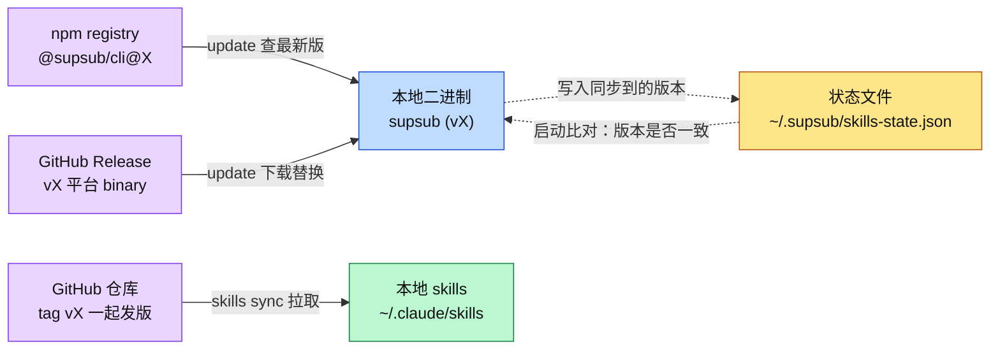
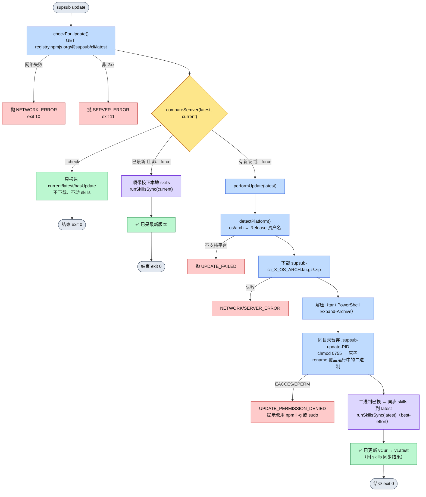
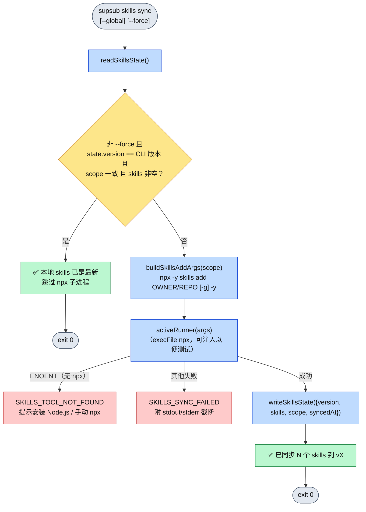
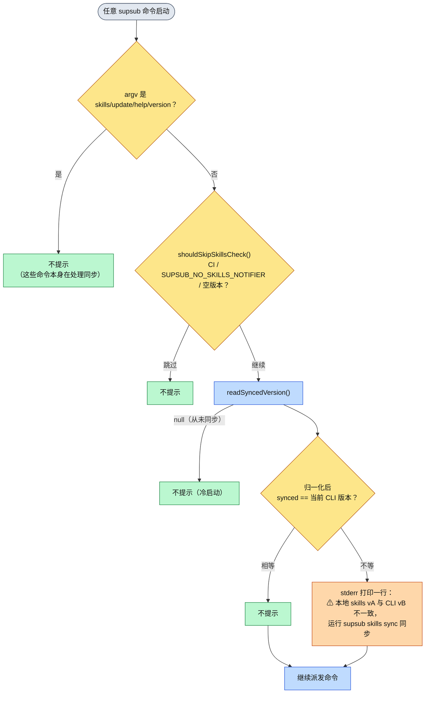
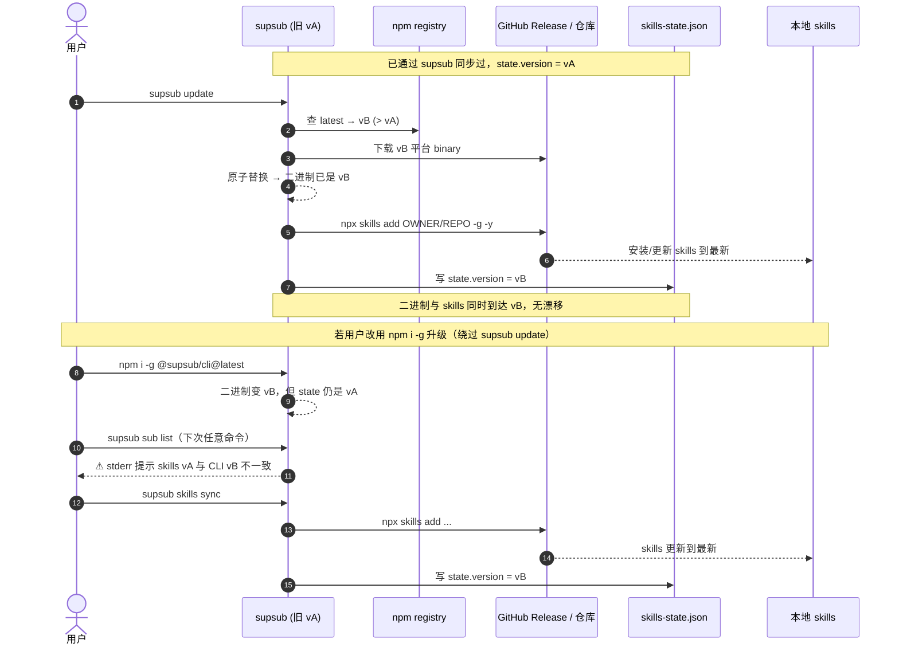

# SupSub CLI 自更新流程（二进制 + Skills）

> 本文以 mermaid 图为主，描述 SupSub CLI 的**两条自更新链路**及其协同：
> 1. **CLI 二进制自更新**（`supsub update`）——查 npm registry 最新版，从 GitHub Release 下载对应平台 binary，原地替换。
> 2. **Skills 同步**（`supsub skills sync`，并在 `update` 时顺带执行）——把本仓库的 Agent Skills 同步到本地 agent 配置，并用「状态文件 + 漂移检测」解决「CLI/skills 发版后，用户本地 skills 没跟着更新」的问题。
>
> 实现位置：
> `src/lib/self-update.ts`（二进制自更新）、`src/commands/update.ts`（update 命令）、
> `src/lib/skills-sync.ts`（skills 同步）、`src/lib/skills-state.ts`（状态文件）、`src/lib/skills-check.ts`（漂移检测）、
> `src/commands/skills.ts`（skills 命令组）、`src/cli/index.ts`（启动漂移提示）。

---

## 0. 为什么需要两条链路

SupSub 的「CLI 本体」与「Agent Skills」是**两份独立分发、却一起发版**的产物：

| 产物 | 分发方式 | 安装位置 | 谁来更新 |
|------|----------|----------|----------|
| CLI 二进制 | npm `@supsub/cli` → postinstall 从 GitHub Release 下载 | npm 全局 bin（`supsub`） | `supsub update` / `npm i -g` |
| Agent Skills | `npx skills add` 拉取本仓库 / Claude Code 插件市场 | `~/.claude/skills`（全局）或 `./.agents/skills`（项目） | `supsub skills sync` |

**核心矛盾**：`supsub update` 只换掉了二进制，本地 skills 仍停留在旧版——出现「二进制 v0.4.0、本地 skills v0.3.2」的**漂移**。本设计参考 `larksuite/cli` 的 `internal/skillscheck`，用一个**状态文件**记录「上次把 skills 同步到的 CLI 版本」，并在每次运行命令时做一次零网络的本地比对，把漂移暴露出来、引导用户 `supsub skills sync`。



---

## 1. CLI 二进制自更新（`supsub update`）

### 1.1 流程图



### 1.2 关键点

- **版本来源**：npm registry 的 `latest` dist-tag（`checkForUpdate`）；`compareSemver` 只比较 `major.minor.patch`，忽略 `v` 前缀与 prerelease 尾巴。
- **资产命名**：`supsub-cli_<version>_<os>_<arch>.<ext>`，与 `scripts/postinstall.cjs` 同一套规则（`buildDownloadUrl` + `detectPlatform`）。
- **原地替换**：先在**二进制同目录**暂存（避免跨文件系统 `EXDEV`），`chmod 0755` 后用 `rename` 原子覆盖——`rename` 可以替换正在运行的可执行文件。
- **独立 fetch**：目标是 `registry.npmjs.org` / `github.com`，不走 `http/client.ts` 的鉴权与 401→clearAuth（与 `api/auth.ts` 的 device 端点同理）。
- **退出码**：沿用 `src/lib/exit-code.ts`（NETWORK=10，SERVER=11，权限/未知归入 SERVER）。
- **与 skills 的衔接**：真正替换二进制后（以及「已最新」分支）调用 `runSkillsSync` 把本地 skills 拉到目标版本；**skills 同步失败不影响二进制更新的既成事实**，只降级为一条 stderr 警告。可用 `--skip-skills` 跳过。

---

## 2. Skills 同步与漂移检测

### 2.1 状态文件 `~/.supsub/skills-state.json`

漂移检测的**唯一依据**。每次 `skills sync` 成功后写入：

```json
{
  "version": "0.3.2",
  "skills": ["supsub-auth", "supsub-sub", "supsub-search", "supsub-mp", "supsub-focus"],
  "scope": "project",
  "syncedAt": "2026-06-29T12:00:00.000Z"
}
```

- 与 `config.json` 同目录（`~/.supsub`，可被 `SUPSUB_CONFIG_DIR` 覆盖），目录 `0700`、文件 `0600`。
- `version` = 同步时的 CLI 版本；漂移检测就是比对它和当前运行二进制的版本。
- 文件缺失 / 损坏一律视为 `null`（**从未通过 supsub 同步过**）——冷启动不打扰用户。

### 2.2 同步流程（`supsub skills sync`）



- **同步机制**：复用社区 `skills` CLI（`npx -y skills add <owner/repo> [-g] -y`），直接从本仓库 GitHub 源拉取——与 README 既有文档、`larksuite/cli` 的 `runSkillsAdd` 同一套命令。
- **范围**：默认 `project`（不带 `-g`，装到当前项目 `./.agents/skills`，**不污染其他项目**）；`--global` 加 `-g`，装到 `~/.claude/skills` 对所有项目可见。全局安装侵入性强，改为显式 opt-in。
- **自更新沿用既有范围**：`supsub update` 顺带的自动同步会读取 `skills-state.json` 里上次的 `scope`，装在哪就同步到哪（老的全局用户保持全局，不会被悄悄改成项目级）；从未同步过则走默认 `project`。
- **runner 可注入**（`setSkillsSyncRunner`）：测试用 fake runner 替换，不真的起子进程 / 连网。
- **owner/repo 来源**：`getRepoSlug()` 解析 `package.json#repository.url`，与 Release 资产同源。

### 2.3 漂移检测（每次运行命令时）



- **零成本**：只读一次本地状态文件，**无网络、无子进程**，放在 `cli/index.ts` 派发命令前执行。
- **只写 stderr**：绝不污染 stdout / `-o json` 的数据，agent 也能从 stderr 解析到这行提示。
- **不打扰原则**：
  - 冷启动（无状态文件）不提示——避免打扰「只用插件市场装 skills、从不经 supsub 同步」的用户；
  - `skills` / `update` / `--help` / `--version` 命令不提示——用户已经在处理；
  - CI / `SUPSUB_NO_SKILLS_NOTIFIER` / 开发版（空、`0.0.0`、`dev`）跳过。

---

## 3. 两条链路如何协同解决「本地未同步」



- **理想路径**：`supsub update` 一步到位——二进制与 skills 一起升级、状态写齐，下次启动无提示。
- **兜底路径**：用户用 `npm i -g`（或包管理器）只换了二进制，漂移检测会在下一条命令把不一致暴露到 stderr，引导 `supsub skills sync`。
- **不可逆/破坏性**：均无。`skills sync` 是幂等覆盖安装；二进制替换有同目录暂存兜底，权限不足时明确报错而非半残。

---

## 4. 命令与环境变量速查

| 命令 | 作用 |
|------|------|
| `supsub update` | 二进制自更新，并顺带同步本地 skills |
| `supsub update --check` | 只查版本，不下载、不动 skills |
| `supsub update --force` | 即使已最新也重装二进制并重同步 skills |
| `supsub update --skip-skills` | 本次更新不同步 skills |
| `supsub skills sync` | 同步本地 skills 到当前 CLI 版本（默认仅当前项目；`--global` 装到全局、`--force` 强制重装） |
| `supsub skills status` | 查看本地 skills 版本 vs CLI 版本、是否漂移 |
| `supsub skills list` | 列出本仓库提供的 skills |

| 环境变量 | 作用 |
|----------|------|
| `SUPSUB_NO_SKILLS_NOTIFIER` | 真值时关闭启动漂移提示（不影响二进制更新提示） |
| `SUPSUB_CONFIG_DIR` | 覆盖配置 / 状态文件目录（默认 `~/.supsub`），测试隔离用 |
| `CI` / `CONTINUOUS_INTEGRATION` | 真值时跳过漂移提示 |
